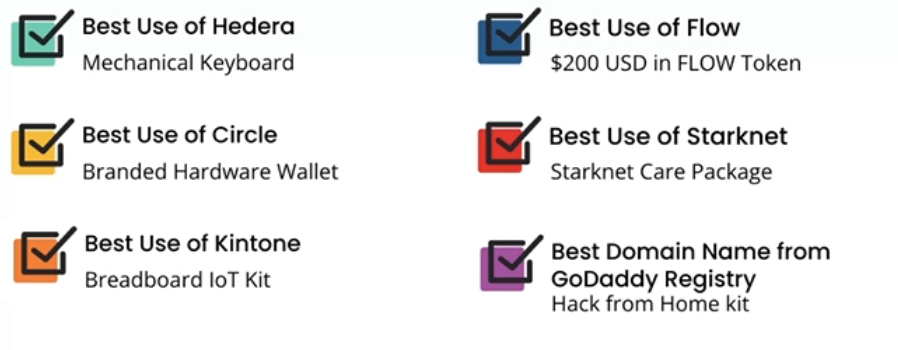

# web3Apps_MLH

domain name from porkbun (godaddy tech.study)
hedera smart contract (mechanical keyboard)
hackp.ac/circle (for wallet bulding)
hackp.ac/flow (deploy to flow)
hackp.ac/starknet (deploy smart contracts)

# Steps:

Set up your development environment: Install the necessary software and tools to develop a blockchain app with Hedera. You can follow the instructions provided in the Hedera documentation.

Create a smart contract: Write a smart contract in Solidity that defines the rules of the game. You can use the Hedera SDK for Solidity to create the smart contract. The smart contract should include the logic for generating a random number between 0 and 5, and for determining whether the user has won or lost the bet.

Deploy the smart contract to the Hedera testnet: Use the Hedera CLI to deploy the smart contract to the Hedera testnet. You can follow the instructions provided in the Hedera documentation.

Create a web application with Next.js: Use Next.js to create a web application that allows users to interact with the smart contract. You can use the Hedera JavaScript SDK to interact with the smart contract from the web application.

Create a wheel component: Create a wheel component in React that displays the numbers from 0 to 5. You can use the React Simple Wheel library to create the wheel component.

Create a betting form: Create a form in React that allows users to place a bet on a number in the wheel. The form should include a field for the user to enter the amount of HBAR they want to bet.

Connect the web application to the smart contract: Use the Hedera JavaScript SDK to connect the web application to the smart contract. The web application should be able to read the state of the smart contract and send transactions to the smart contract.

## Deploy on Vercel

The easiest way to deploy your Next.js app is to use the [Vercel Platform](https://vercel.com/new?utm_medium=default-template&filter=next.js&utm_source=create-next-app&utm_campaign=create-next-app-readme) from the creators of Next.js.

Check out our [Next.js deployment documentation](https://nextjs.org/docs/deployment) for more details.
